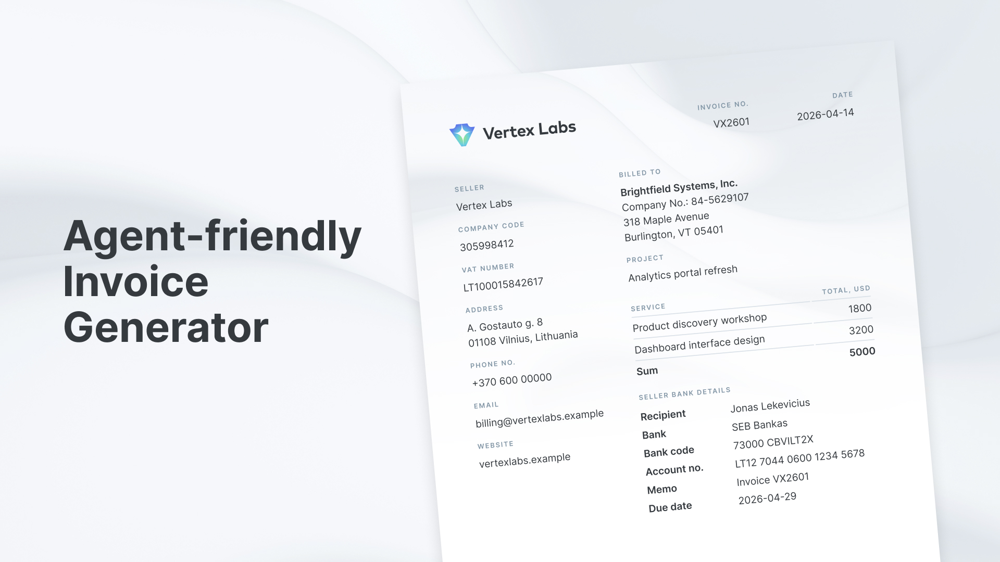

# Invoicer



Invoicer is an agent-friendly invoice generator for producing polished PDFs from structured JSON. It keeps invoice content, seller identity, bank rows, assets, and theme tokens separate, so an AI coding agent can draft invoices, update seller configuration, validate data, and regenerate PDFs without poking through layout code.

## Features

- Agent-readable `skill/` instructions for drafting invoices and generating PDFs.
- Schema-validated invoice and seller JSON, so agents get fast feedback on bad data.
- Seller-owned config for left-column details, bank rows, logo, signature, colors, and fonts.
- Portable example data and assets that agents can copy, adapt, and test.
- Typst templates for precise A4 layout without asking agents to hand-place every field.
- Debug render JSON for inspecting exactly what the agent passed into Typst.
- Matching Figma community template for visual customization: [Invoicer template](https://www.figma.com/community/file/1626308788823411442).

## Get Started With an Agent

Ask your agent to set up your seller config:

```text
Read the README and skill/SKILL.md in this repo. Create my seller/seller.json from the example seller config, replacing the seller details, bank rows, logo, signature, theme colors, and font paths with my own. Keep paths relative to seller/seller.json where possible, then run the generator on the example invoice to verify it compiles.
```

Then ask it to make an invoice:

```text
Use the invoicing skill in this repo. Create the next invoice JSON in invoices/, using my seller/seller.json, buyer legal details, project name, currency, and line items. Generate the PDF into pdfs/ and tell me the output path.
```

For recurring use, install or copy the `skill/` directory into your agent's skills folder so it can follow the bundled workflow directly.

## Requirements

- [Bun](https://bun.sh/)
- [Typst](https://typst.app/)

Install dependencies:

```bash
bun install
```

## Generate an Invoice

Run the bundled example:

```bash
./example/generate.sh all
```

Generate a specific invoice with the CLI:

```bash
bun run generate -- example/invoices/VX2601.json \
  --seller example/seller/seller.json \
  --out example/pdfs/VX2601.pdf
```

You can also write the intermediate render JSON for debugging:

```bash
bun run generate -- example/invoices/VX2601.json \
  --seller example/seller/seller.json \
  --json /tmp/VX2601.render.json \
  --render-only
```

## Invoice JSON

Invoice files contain buyer details, invoice metadata, and line items:

```json
{
  "meta": {
    "schema": 1,
    "locale": "en-US"
  },
  "invoice": {
    "number": "VX2601",
    "issue_date": "2026-04-15",
    "due_date": "2026-04-29",
    "currency": "USD",
    "project": "Analytics portal refresh"
  },
  "buyer": {
    "name": "Brightfield Systems, Inc.",
    "company_code": "84-5629107",
    "address": ["318 Maple Avenue", "Burlington, VT 05401"]
  },
  "items": [
    {
      "title": "Product discovery workshop",
      "amount": 1800
    }
  ]
}
```

The invoice total is calculated from `items`.

## Seller JSON

Create a seller file with configurable left-column details, bank detail rows, optional assets, and theme:

```json
{
  "seller": {
    "details": [
      {
        "label": "Seller",
        "lines": ["Vertex Labs"],
        "first_weight": "semibold"
      },
      {
        "label": "Company code",
        "lines": ["305998412"]
      },
      {
        "label": "VAT number",
        "lines": ["LT100015842617"]
      },
      {
        "label": "Address",
        "lines": ["A. Gostauto g. 8", "LT-01108 Vilnius, Lithuania"]
      },
      {
        "label": "Phone",
        "lines": ["+370 5 214 0148"]
      },
      {
        "label": "Email",
        "lines": ["billing@vertexlabs.example"]
      },
      {
        "label": "Website",
        "lines": ["vertexlabs.example"]
      }
    ],
    "bank_details": [
      { "label": "Recipient", "value": "Vertex Labs" },
      { "label": "Bank", "value": "SEB Bankas" },
      { "label": "SWIFT/BIC", "value": "CBVILT2X" },
      { "label": "Account no.", "value": "LT12 7044 0600 1234 5678" },
      { "label": "Memo", "value": "Invoice {invoice_number}" },
      { "label": "Due date", "value": "{due_date}" }
    ],
    "assets": {
      "background": "assets/artwork.png",
      "logotype": "assets/logotype.svg",
      "signature": {
        "svg": "assets/signature.svg",
        "x": 54,
        "y": 720,
        "width": 200
      }
    },
    "theme": {
      "colors": {
        "background": "#FFFFFF",
        "heading": "#8195A5",
        "text": "#353A3F",
        "border": "#D9E0E7"
      },
      "font": {
        "family": "Inter",
        "paths": ["assets/fonts"]
      }
    }
  }
}
```

Asset and font paths can be absolute, but relative paths are recommended. Relative paths resolve from the directory containing `seller.json`.

The logo is rendered at the layout size of `152x27`. The example signature is pinned to `width: 200`, which preserves the bundled SVG's `200x56` aspect ratio at `x: 54`, `y: 720`.

`bank_details.value` supports `{invoice_number}`, `{issue_date}`, `{due_date}`, `{currency}`, and `{project}` placeholders.

## Skill

The `skill/` directory contains agent instructions for drafting invoice JSON, choosing invoice numbers, and generating PDFs. It is intentionally separate from this README: agents should read `skill/SKILL.md`, while people should start here.
